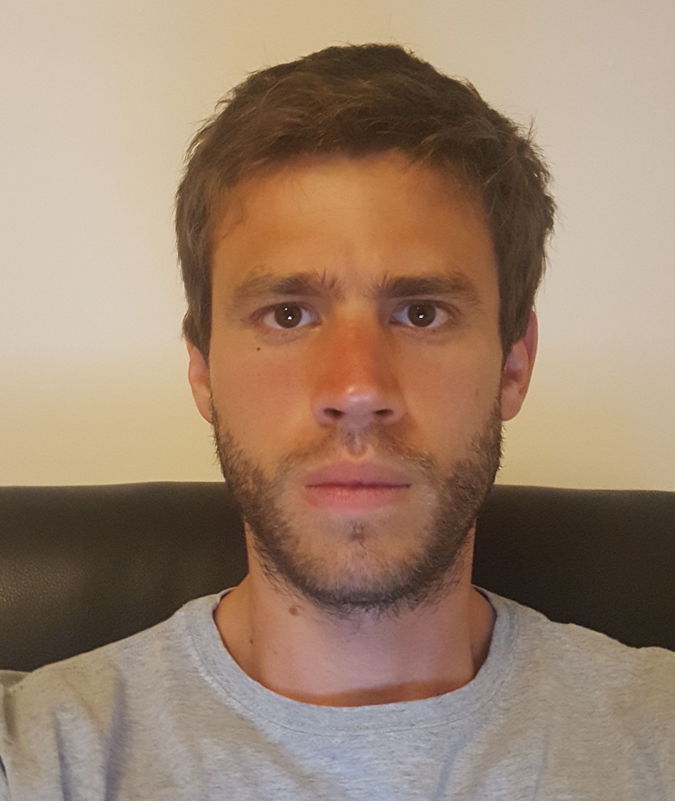

\

0.3

0.4

[{width="4.5cm"}](http://www.crisil.com)\

\

Av. Del Libertador 174\
Vicente López, Buenos Aires\
Argentina

+54 9 11 6482 4868\
\

0.2

{width="3.5cm"}

Academic Formation

&

*MSc Nuclear Engineering*

Balseiro Institute, Cuyo National University & National Atomic Energy
Commission. San Carlos de Bariloche, Argentina.\
GPA: 8.40/10.

&

(0cm,-0.6cm)[{width="0.8cm"}](http://www.ib.edu.ar/english_version/Instituto_Balseiro.php)

\

 &\

& Completed the first two years of Aeronautical Engineering.\
National Technological University, Haedo Regional Faculty. Buenos Aires,
Argentina.\
GPA: 9.20/10.  &

(0cm,-0.6cm)[{width="0.8cm"}](https://www.utn.edu.ar/es/)

\

Professional Experience

& , Buenos Aires, Argentina & New York, United States of America\
*Senior Quantitative Analyst*  &

(0cm,-0.6cm)[{width="0.9cm"}](https://www.crisil.com)

\

 &\
  &\

 &\
  &\

 &\
  &\

& , Buenos Aires, Argentina\
*Engineering Consultant*  &

(0cm,-0.6cm)[{width="0.8cm"}](http://www.besna.com.ar)

\

 &\
  &\

&  Engineering Studies and Projects, Buenos Aires, Argentina\
*S/Sr Nuclear Engineer*  &

(0cm,-0.6cm)[{width="0.8cm"}](http://www.tecna.com/Home/tabid/40/language/en-US/Default.aspx)

\

 &\
  &\

 &\
  &\

& , Nuclear Engineering Department, San Carlos de Bariloche,
Argentina\
*Undergraduate intern*  &

(0cm,-0.6cm)[{width="0.8cm"}](http://www.invap.com.ar/en/)

\

 &\

&  National Atomic Energy Commission, Bariloche Atomic Centre\
*Scholarship – Student*  &

(0cm,-0.6cm)[{width="0.8cm"}](http://www.cnea.gov.ar)

\

 &\

Grants

 & Scholarship from the National Atomic Energy Commission
(CNEA) to study Nuclear Engineering at the Balseiro Institute.\
\

Languages  & Native language.\
  & Speaks, reads and writes fluently.\

Programming and Software  & C/C++/C\#, R,
Python, FORTRAN, Scripting (bash, AWK, sed, curl, etc), LaTeX,
etc.\
  & GNU Scientific Library, PETSc, SLEPc, GNU Octave,
Matlab, Mathematica, git, wasora, milonga, etc.\

Open and Private software

& Wasora is a convenient high-level interface to perform
mathematical computations. It also provides a framework which other
particular computational codes can use. It is a free computational tool
designed to aid a cognizant expert to analyze complex systems by solving
mathematical problems by means of a high-level plain-text &

(0cm,-0.5cm)[{width="1.2cm"}](https://github.com/seamplex/wasora)

\

\

& Milonga is a free core-level neutronic code that solves the
steady-state multigroup neutron transport equation (using the diffusion
approximation, discrete ordinates $S_N$ method or the method of
characteristics) over unstructured grids (although simple structured
grids can also be used) using either a finite-volumes or a
finite-elements discretization scheme. &

(0cm,-0.5cm)[{width="1.2cm"}](https://bitbucket.org/rvignolo/milonga)

\

\

& Mate solves steady-state systems involving mixtures of steam and
water (Two-Phase Flow) in different one dimensional, but still complex,
geometries. Mass, Momentum, and Energy distributions are obtained
through a finite difference scheme. It is intended to be free and open
in the short term. &

(0cm,-0.5cm)[{width="1.2cm"}](https://github.com/rvignolo/mate)

\

\

& Kosmos is a derivative pricing engine in current and active
development. &

(0cm,-0.5cm)[{width="1.2cm"}](https://github.com/rvignolo/kosmos)

\

\

0.35

Ramiro Vignolo\
18./date.sh &gt; date.tex  18./hash.sh &gt; hash.tex

@shellescape
